# Mermaid UML

A másik lehetőség a PlantUML, ami bonyolultabb, de több lehetőséget biztosít.

---

## 1. Class Diagram

### Alap példa

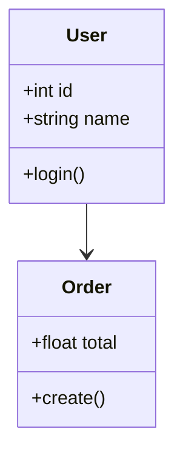

### Láthatóság

| Jelölés | Jelentés         |
| ------- | ---------------- |
| +       | public           |
| -       | private          |
| #       | protected        |
| ~       | package/internal |

---

### Kapcsolatok

| Típus                   | Jelölés |
| ----------------------- | ------- |
| Association             | `-->`   |
| Dependency              | `..>`   |
| Inheritance             | `<--`   |
| Realization (interface) | `<..`   |
| Aggregation             | `o--`   |
| Composition             | `*--`   |

#### Példa

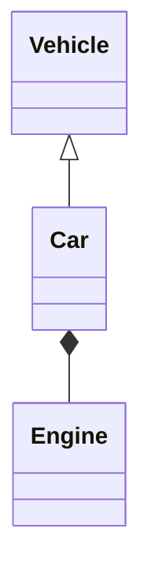

---

### Multiplicity

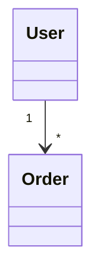

---

## 2. Sequence Diagram

Objektumok közötti kommunikáció időrendben.

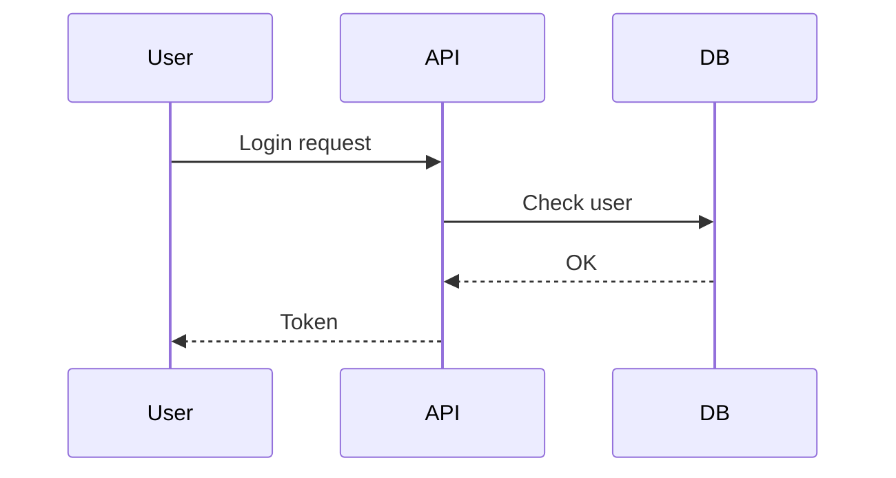

### Nyíl típusok

| Jel    | Jelentés                             |
| ------ | ------------------------------------ |
| `->>`  | szinkron hívás                       |
| `-->>` | válasz                               |
| `-x`   | megszakítás                          |
| `->>`  | aszinkron (általában így használják) |

---

## 3. State Diagram

Állapotgépekhez (embedded rendszereknél különösen hasznos).

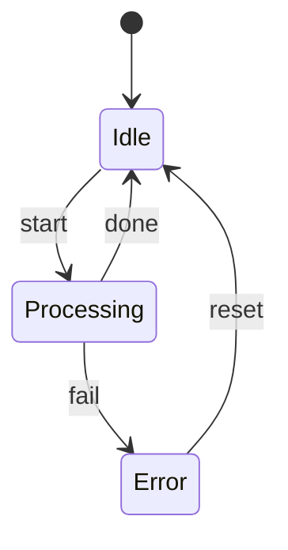

---

## 4. Flowchart (Activity Diagram helyett)

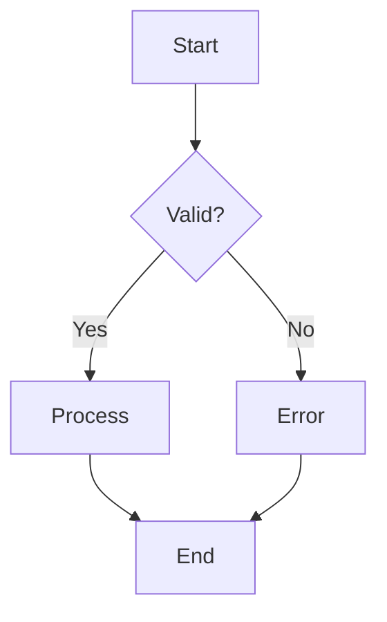

---

## 5. Component Diagram (egyszerű architektúra)

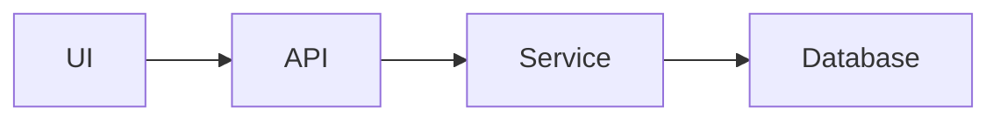

---

## 6. Interface használat

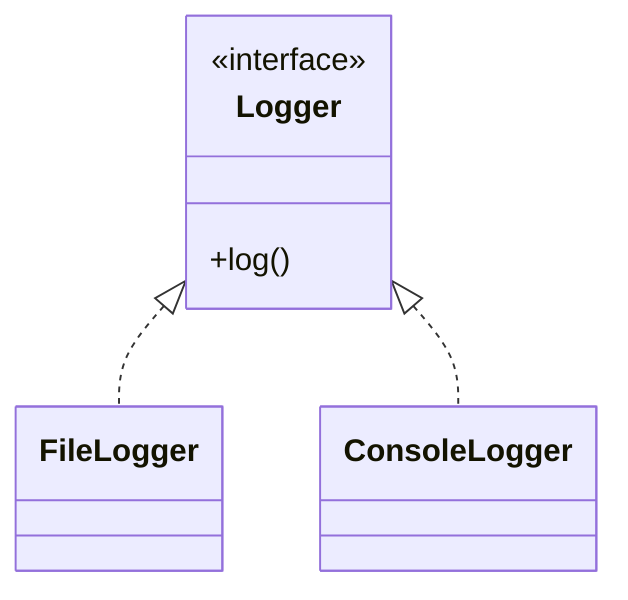

---

## 7. Notes (megjegyzések)

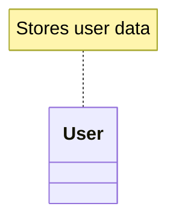

---

## 8. Packages / Namespace

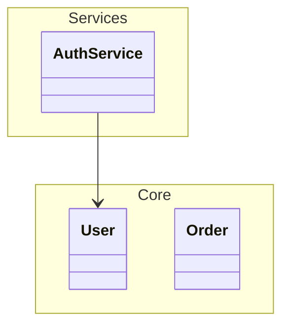

---

## 9. GitHub-kompatibilis alap sablon

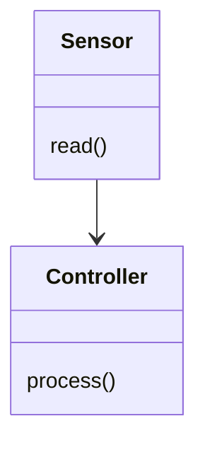

---

## 11. Mikor melyiket használd?

| Cél | Diagram |
| --- | --- |
| OOP tervezés | Class |
| API / folyamat | Sequence |
| Embedded / FSM | State |
| Logika | Flowchart |
| Rendszer architektúra | Component (flowchart) |

---

## 12. Hasznos eszközök

* GitHub README (natív támogatás)
* Obsidian (Mermaid plugin)
* VS Code (Markdown Preview Mermaid)
* [online editor](https://mermaid.live)
